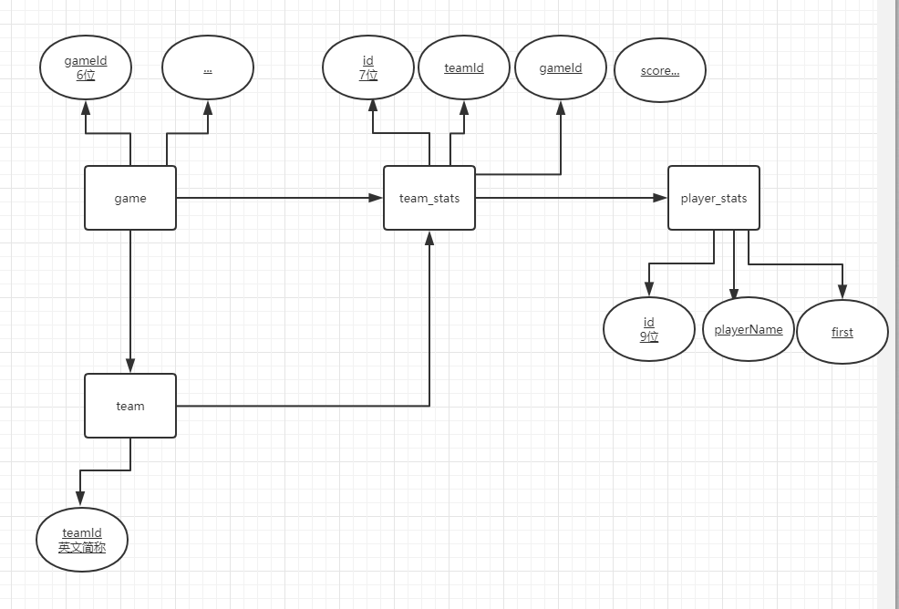
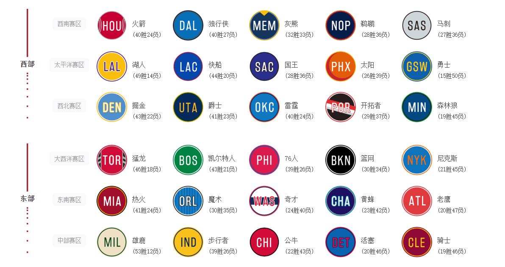
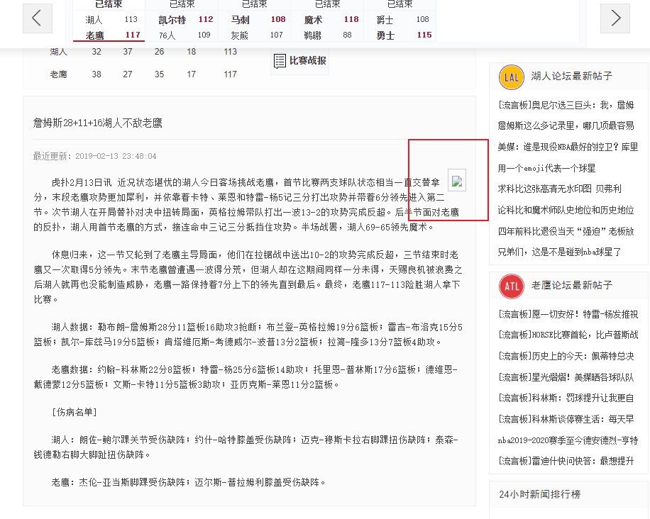
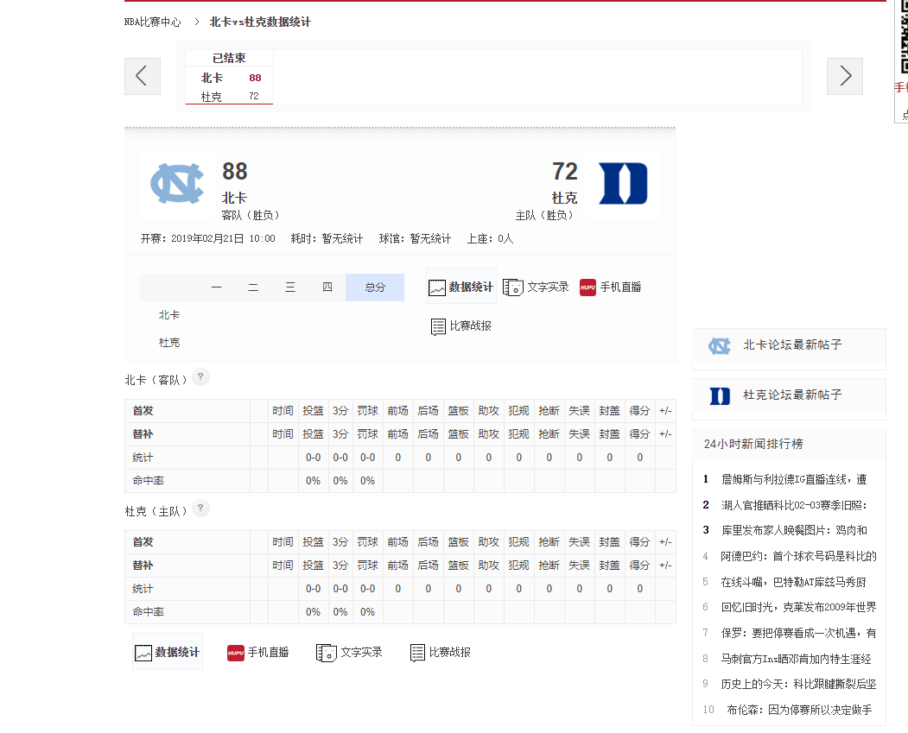
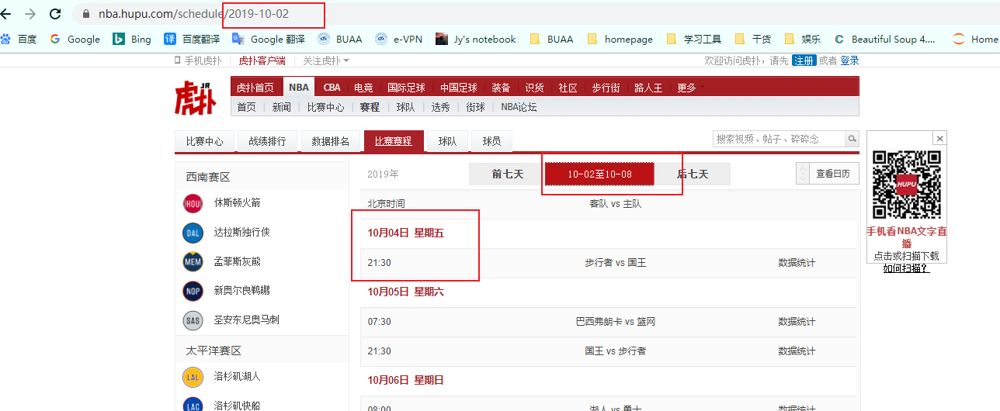

# Hupu Spider

所有数据均来源于[虎扑NBA](https://nba.hupu.com/schedule) 。

## 更新日志

### 2020-05-10

- 对已延期比赛进行了处理，并导入到数据库的future_game表中
- 在 `update_game` 时，如果比赛状态从延期变为结束，则会将数据更新到 game表，并删除 future_game 表中的相关比赛数据。

## 数据库设计

- 简版如下

- game

  - 比赛ID（主键）：gameId
  - 比赛的基本信息：gameTime，consumeTime，arena，peopleNum，比分（115:120）。
  - 比赛队伍：away_team，home_team，这里仅存球队的简称（比如LAL）作为外键，以链接team表。
  - 比赛得分信息：
  - 双方技术统计：客队技术统计，主队技术统计，这里也仅存ID，作为外键，以链接stats表。
- team_score_stats
- player_score_stats（比赛技术统计）
- recap
- team

  - 球队名简称（主键）
  - 球队的基本信息：

## 项目结构说明

### 1. spider

每一个 spider 负责爬取一类数据，一般包含 `xxx_spider()` 、`get_xxx_data()` 、`write_xxx()` 三个主要函数，分别负责 main，爬取指定数据以及将数据写到本地 `./data/` 文件夹下。

#### team_spider

爬取以下30支球队信息。

- 数据来源：https://nba.hupu.com/teams

- 数据说明：
  - `teamId` ：球队的英文简称
  - `teamName` ：球队全名
  - `buildTime` ：球队建立时间
  - `area` ：所属赛区
  - `homeCourt` ：主场
  - `chiefCoach` ： 主教练
  - `logoUrl` ：球队logo
  - `website` ：球队的nba官方网站
  - `description` ：球队简介

- 重要函数说明
  - team_spider()
    - 默认爬取虎扑30支球队的基本信息，并将数据写入 `./data/teams/teams.csv` 中；
    - 若上述文件已存在，则直接返回，不重复爬取。

#### schedule_spider

示例：

- 数据来源：https://nba.hupu.com/schedule/
- 数据说明：
  - `gameId` ：比赛id
  - `gameTime` ：比赛时间
  - `gameTeam` ：比赛双方的球队，如 LALvsMIN
  - `gameOver` ：表明比赛是否已经结束
- 重要函数说明
  - get_schedule(date)
    - 爬取指定日期的赛程信息到本地，如 `./data/games/2019-01-01/2019-01-01-schedule.csv` 
  - schedule_spider(dates)
    - 爬取dates中所有日期的赛程信息，并将所有赛程信息加入到 `./data/games/all_schedule.csv` 中
    - 在获取某一天的赛程信息后，schedule_spider 会根据 `gameId` 调用 game_spider() 爬取相应比赛的信息。 

#### game_spider

game的爬取是最麻烦，细节最多，也是出bug最多的一类数据。

- 数据来源：https://nba.hupu.com/games/boxscore/

- 数据说明：
  - game_base_info
    - gameId, gameTime, consumTime, arena, peopleNum
  - team_score_stats
    - id, teamId, gameId, isHome, score1, score2, score3, score4, score
  - player_score_stats
    - id, teamId, teamStatsId, playerName, isFirst, position, playMinute, shot, threeShot, penaltyShot, frontCourt, backCourt, rebound, assist, foul, steal, fault, block, score, Contribution
    - 这个表数据字段较多，可参看[这个例子](https://nba.hupu.com/games/boxscore/158438) 。
  - game_recap
    - gameId, header, content, updTime, capture

- 重要函数说明

  - game_spider(path, game)

  - get_game_data(game_id)

    - 分别爬取下面四个子类的数据，保存到四张csv表中。其中 `team_score_stats` 和 `player_score_stats` 由于牵涉到两个球队的数据，稍显麻烦。
    - get_game_base_info(game, game_id)
    - get_team_score_stats(game, gameId)
    - get_player_score_stats(game, gameId)
    - get_game_recap(game, game_id)

  - write_game_data(path, dir_name, 

    ​          game_base_info, 

    ​          team_score_stats, 

    ​          player_score_stats,

    ​          game_recap)

#### anti_spider

这个类是最后才加上的，目的是为了在一定程度是反反爬虫措施。

目前仅仅做了如下工作：

- get_html()
  - 在获取html源码时，随机休眠 0~1 秒的时间；
  - 支持 selenium + FireFox 爬取，需要在 config.py 中设置 `use_selenium=True` 。
- sleep_random(max_time)
  - 随机休眠一段时间（0~max_time）。

可进一步改进的方向

- 在获取html源码时，采用 request 代替简单的 urlopen，并加入 `header` 、 Cookies 等信息，以更好地模拟人工操作。

### 2. data

#### data_generator

数据生成器，目前支持

- gen_dates_by_year(year)
  - 通过指定年份，生成这一年内所有日期的列表，格式化为 `YYYY-MM-DD` 。
- gen_dates_by_month(year, month)
  - 通过指定年份与月份，生成这一年这一个月内所有日期的列表，格式化为 `YYYY-MM-DD` 。

#### data_handler

提供数据清洗的一些函数，为了防止 spider 类过于臃肿，因此将其单独分离出来。

目前支持

- map_team(team_str)
  - 将中文的球队名替换为英文简称，如：勇士 -> GSW 。

- format_player_stats(df, team_score_stats_id)
  - 将爬取到的球员技术统计信息进行格式化处理，包括重置标题行，以及删除无用行，生成唯一id等操作。

#### mysql_updater

提供一系列 `xx2mysql()` 函数，借助 `pymysql` + `sqlalchemy` ， 用于将本地的csv导入到mysql数据库。

第二版优化了如下细节：

- clear_mysql() 
  - 避免了测试时每次都要手动清空数据库的麻烦；
  - 保证该函数仅仅在初始化数据库时被调用。
- set_default_primary()
  - 设置 team、game、team_score_stats、player_score_stats、recap 这五张表的主键。

### 3. others

调用者只需关注这两个文件即可，在config中配置相关信息，并在main中执行。

#### config

- 配置数据库信息，包括用户名、密码以及数据库名称。
- 选择爬取策略。
  - 如是否使用 `selenium` 进行爬取。这种方法能够真实的模拟人工操作，但将大大降低程序执行的速度。
  - 需要配置 selenium 的环境。

#### main

为调用者提供的主类，提供了

- init_all():
  - init_dir()         *# 清空data文件夹*
  - init_data()      *# 爬取所有数据到本地*
  - init_mysql()   *# 初始化数据库*

- update_dates(dates)：
  - 用户可以手工指定 dates，或利用 data_generator 中的 gen_dates 函数生成 dates 数据，来更新相应日期的比赛数据到 MySQL 中。

- update_today()
  - 默认更新当天的比赛数据到 MySQL 中。

## 运行说明

- 配置config文件下的数据库信息

- 指定 main.py 中的 `init_data()` 数据范围
  - 注意由于虎扑的反爬虫措施，这里dates范围不宜过大。
- 运行main.py中的 `init_all()` 即可，可手工会自动爬取所有比赛数据，并更新到MySQL。
- 后续可以执行 `updates_dates()` 或 `updates_today()` 以更新指定日期的比赛数据。

## 部分BUG记录

### HTTPs Error

[2020-02-13] 这里能采集到精彩瞬间的图片，但是链接失效，导致HTTPs Error

解决办法：

在更改爬取策略，只保存图片链接而不下载图片后，这个问题也就迎刃而解了。

### 数据缺失

2019-02-21 ，数据缺失

解决办法：

这里没有数据是因为虎扑现在只保存了上面30支球队的数据，因此这两个球队的数据被清空了。因此需要在 get_schedule 中进行 `check_data()` 操作。

### 另一种数据缺失

[2019-10-02] 当天没有比赛，导致将10-04的比赛数据错误的给了10-02。

解决办法：

同上，在 `check_data()` 中判断日期是否一致即可。

### csv2sql

利用sqlalchemy以及pd.to_sql虽然能够很方便的导入，但是这种做法不能指定主键。

解决办法：

利用 pymysql 手工指定主键。

### 虎扑的反爬虫措施

目前的最佳解决办法是，**分批次爬取**：

- 首先执行 `init_all()` 操作，并保证此时 `init_data()`  的数据量不能过大（一个月为最佳），这样能够初始化data文件以及数据库信息。
- 利用 data_generator 中的 `gen_dates_by_month()` 依次生成各个月份的数据，并利用 main 中提供的 `update_dates(dates)` 进行数据的爬取与更新。
  - 这个操作保证将赛程信息追加到 `all_schedule.csv` 中。但如果程序运行时被反爬虫机制针对的话，可以强制结束程序。这样 `all_schedule.csv` 的数据还没有来得及更新，因此重新爬取该月份的数据即可。
  - 当然，在 `schedule2mysql()` 中也对读取到的 `all_schedule` 进行了去重操作，保证不会将数据重复加入数据库。

