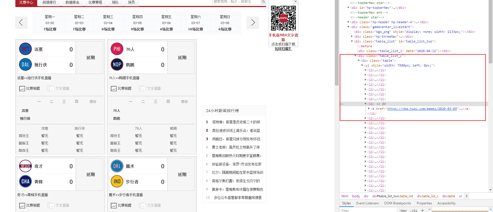
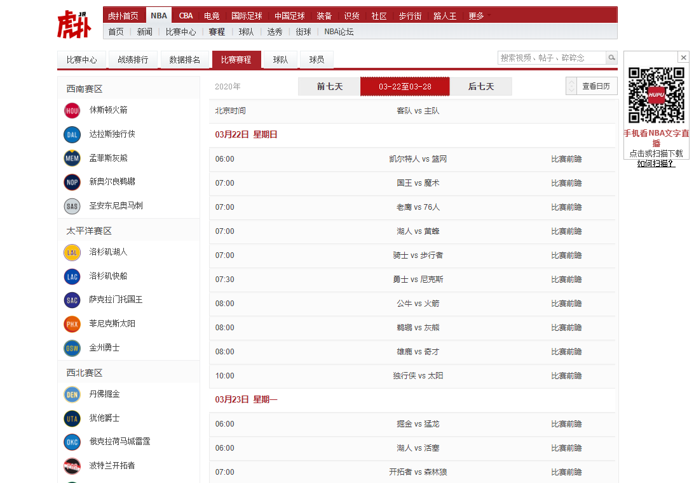
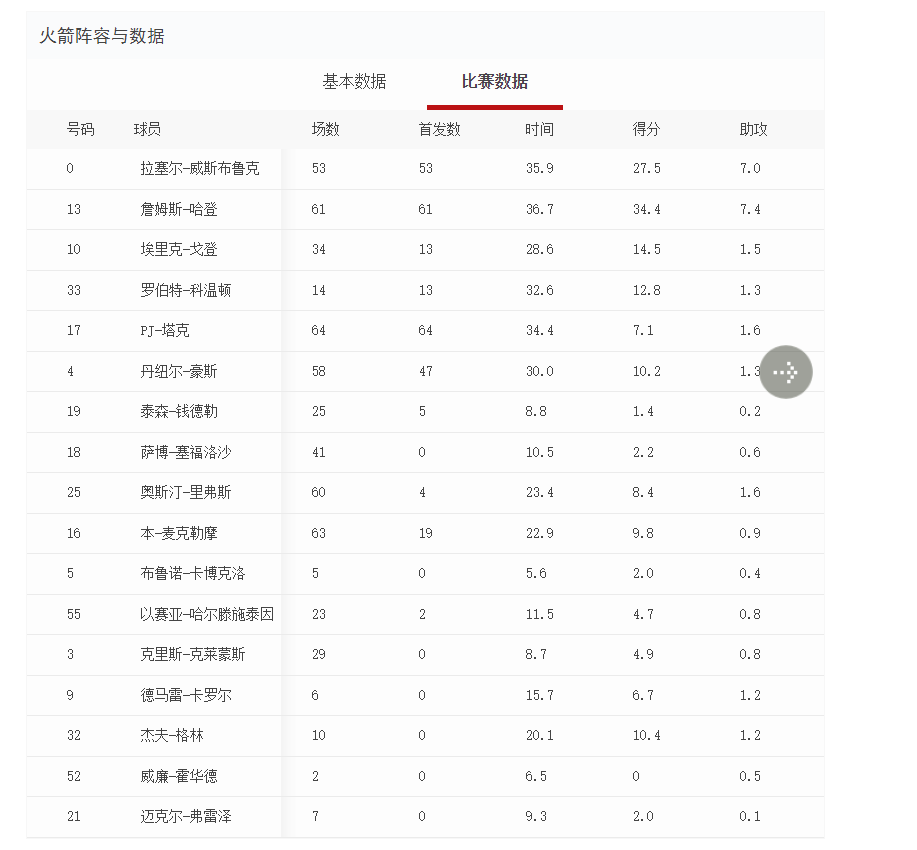
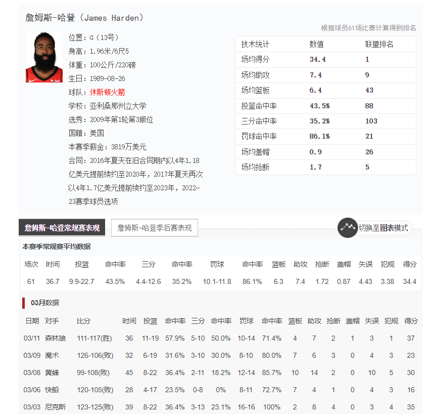
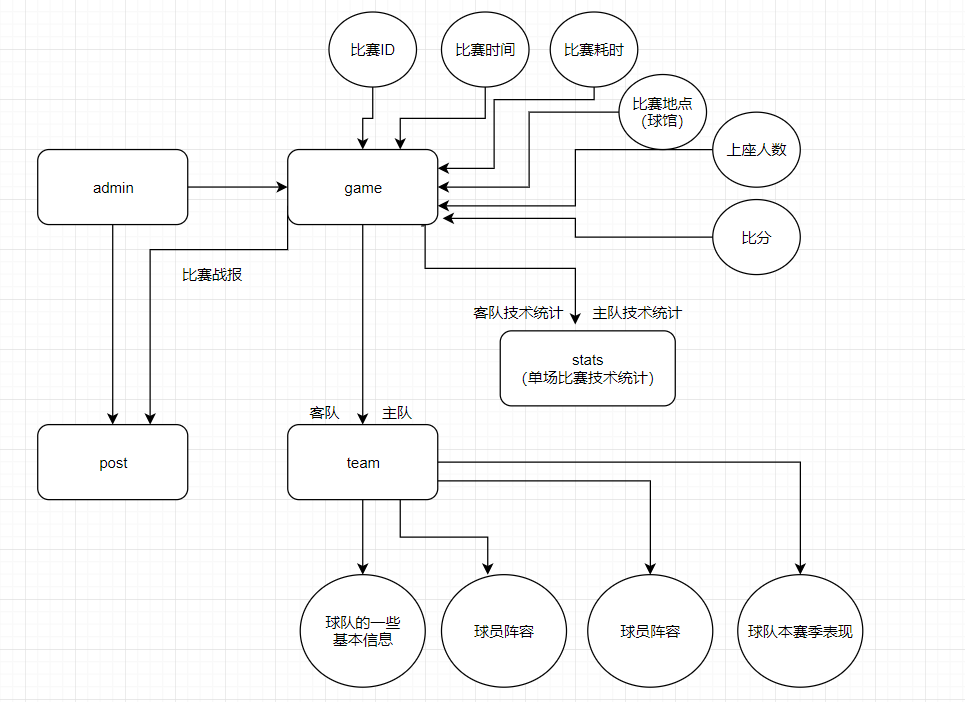

# Hupu Spider

## 数据准备

### data/

#### games/

赛事的基本信息，如时间、参与双方详情、比赛结果、相关比赛数据以及相关精彩瞬间图片等。

虎扑的比赛赛程(https://nba.hupu.com/schedule/2020-03-22) 中也会展示比赛信息。对于尚未进行的比赛，可以通过“比赛前瞻”查看两支球队的历史数据，以及**预测胜率**。对于已经结束的比赛，可以通过“数据统计”

- 2020-3-1
  - 勇士vs太阳
    - game_base_info.csv，比赛的基本信息，包括：
      - 比赛时间：2020年03月01日 10:00
      - 耗时：02:13
      - 球馆：托金斯迪克度假酒店球馆
      - 上座：16395人
    - game_score_info.csv
      - 比分情况：包括各小节与总比分
    - away_team_score_table.csv
      - 各个球员在该场比赛中的技术统计，包括：姓名，位置，时间，投篮，3分，发球，前场，后场，篮板，助攻，犯规，抢断，事务，封盖，得分，+/-（净胜分）等信息的记录。
      - 对整个队的在该场比赛中的技术统计。
    - home_team_score_table.csv
      - 同上
    - game_recap.csv
    - capture.csv
- 2020-3-2

#### players/

统计以下30支球队信息。

参考下图，包括球队基本信息，各个赛季的技术统计，以及球队阵容与各球员的详细数据（基本数据与比赛数据）。

#### teams/

包括球员基本信息，以及更加详细的技术统计数据（加入对每场比赛的数据统计）。

## 数据库设计

- 简版如下

- game

  - 比赛ID（主键）：gameId
  - 比赛的基本信息：gameTime，consumeTime，arena，peopleNum，比分（115:120）。
  - 比赛队伍：away_team，home_team，这里仅存球队的简称（比如LAL）作为外键，以链接team表。
  - 比赛得分信息：
  - 双方技术统计：客队技术统计，主队技术统计，这里也仅存ID，作为外键，以链接stats表。

- team_score_stats

  - id
  - teamId
  - isHome boolean
  - 

- stats

- team

  - 球队名简称（主键）
  - 球队的基本信息：
  - 球员阵容：这个我还没考虑好。
  - 球队本赛季表现：这里有两种实现。
    1. 不存数据库，在最后需要展示该数据时，利用stats表，筛选出来进行累加即可，同时也能保证数据一致性。
    2. 无条件信任虎扑，直接从虎扑上爬取本赛季的表现，并参考stats做成实体表。

- stats（单场比赛技术统计）

- 说明

  - game中比较特殊的是stats，由于包含的信息较多，因此我想的是考虑作为一个实体，game表中只存ID，但是技术统计的信息包含的太杂了，具体怎么设计我没想好，可能需要大家集思广益一下。
  - 所有比赛相关的信息，可以通过 `./data/比赛时间/客队vs主队/` 获得。
    - 例，`./data/2019-01-01/GSWvsPHX/`
    - 包括比赛基本信息，比分信息，客队技术统计，主队技术统计，比赛战报。

  

## BUG记录

### 2020-02-13

这里能采集到精彩瞬间的图片，但是链接失效，导致HTTPs Error

### 2019-02-21

数据缺失

### 2019-10-02

当天没有比赛，导致将10-04的比赛数据错误的给了10-02。

### csv2sql

利用sqlalchemy以及pd.to_sql虽然能够很方便的导入，但是好像这种做法不能指定主键？

